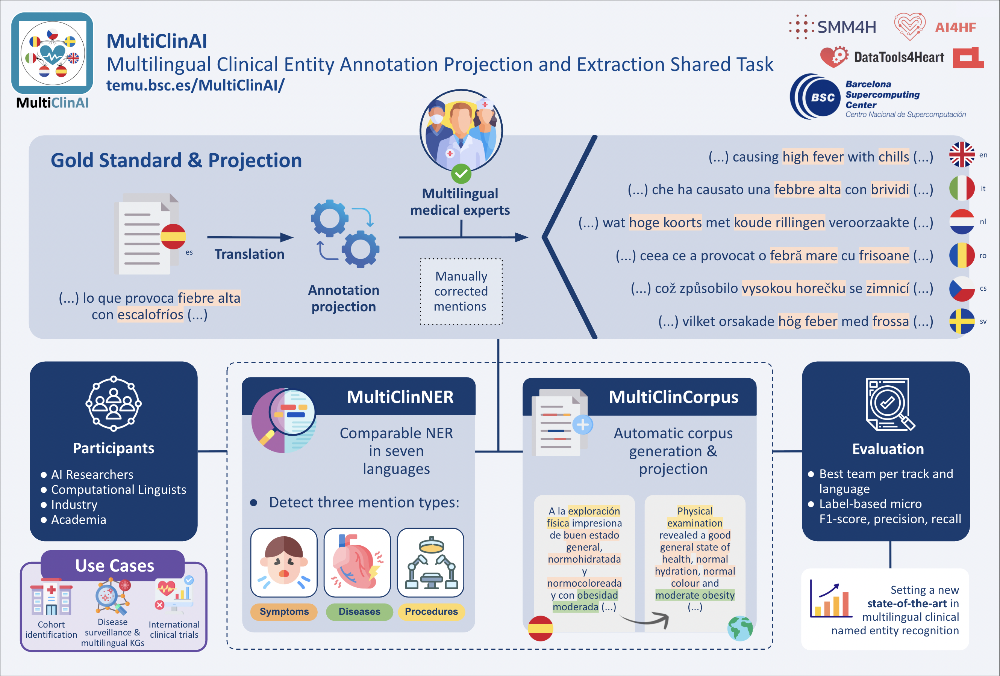

# MultiClinAI Evaluation

<p align="center">
  
</p>

This repository contains the **official evaluation script** for the **MultiClinAI shared task**.

MultiClinAI focuses on **clinical Natural Language Processing (NLP)**, aiming to advance the development of systems capable of extracting structured clinical information from multilingual clinical texts.

More information about the task can be found on the official website:

**https://temu.bsc.es/MultiClinAI/**

---

# Task Overview

The goal of the task is to evaluate **Named Entity Recognition (NER)** systems applied to clinical documents.

Participants must identify and classify entities in clinical text using the following annotation format.

| filename | label     | start_span | end_span | text     |
| -------- | --------- | ---------- | -------- | -------- |
| doc1.txt | DISEASE   | 10         | 18       | diabetes |
| doc1.txt | SYMPTOM   | 40         | 45       | fever    |
| doc1.txt | PROCEDURE | 60         | 67       | biopsy   |

Column description:

* **filename** → document identifier
* **label** → entity type
* **start_span** → start character offset of the entity
* **end_span** → end character offset of the entity
* **text** → entity surface form

Offsets are **character-based** and correspond to the span in the document text.

---

# Evaluation Metrics

The evaluation script computes two complementary metrics.

## Strict Match

A prediction is considered correct if:

* the document identifier matches
* the entity label matches
* the start offset matches
* the end offset matches

This corresponds to **exact span matching**.

Matching is **one-to-one**:

* each gold annotation can match at most one prediction
* each prediction can match at most one gold annotation

The script reports:

* Precision
* Recall
* F1-score
* True Positives (TP)
* False Positives (FP)
* False Negatives (FN)
---

## Character-Overlap F1

This metric evaluates h**ow well predicted spans align with gold spans at the character level**, providing a smoother alternative to strict matching.

For two spans, the **character-overlap F1** is computed as:

* intersection = length of the overlapping character segment
* recall = intersection / length_gold
* precision = intersection / length_prediction
* char_overlap_f1 = 2 * precision * recall / (precision + recall)

If a gold entity has no overlapping prediction, its score is 0.
If a prediction does not overlap any gold entity, its score is 0.
Unlike strict matching, this metric does not enforce one-to-one matching between spans.

---

# Repository Structure

```
MultiClinAI_Evaluation
│
├── assets
│   ├── gold_standard.tsv
│   └── dummy.tsv
│
├── img
│   └── logo.png
│
├── src
│   └── evaluate.py
│
└── README.md
```

**assets/gold_standard.tsv**
Reference annotations used for evaluation.

**assets/dummy.tsv**
Example prediction file.

**src/evaluate.py**
Evaluation script used to compute the metrics.

---

# Running the Evaluation

The evaluation script compares a prediction file against the gold standard annotations.

## Basic usage

```
python src/evaluate.py --pred assets/dummy.tsv
```

---

## Evaluate a specific entity

```
python src/evaluate.py --pred predictions.tsv --entity DISEASE
```

---

## Using a custom reference file

```
python src/evaluate.py --reference custom_gold.tsv --pred predictions.tsv
```

---

# Expected Prediction Format

The prediction file must follow **exactly the same TSV format** as the gold standard.

```
filename	label	start_span	end_span	text
doc1.txt	DISEASE	10	18	diabetes
doc1.txt	SYMPTOM	40	45	fever
doc1.txt	PROCEDURE	60	67	biopsy
```

Required columns:

```
filename
label
start_span
end_span
text
```

The evaluation script **strictly validates the schema** and will raise an error if any required column is missing or incorrectly formatted.

---

# Example Output

Example JSON output produced by the evaluation script:

```json
{
  "entity": "DISEASE",
  "strict": {
    "precision": 0.3333,
    "recall": 0.5,
    "f1": 0.4,
    "tp": 1,
    "fp": 2,
    "fn": 1
  },
  "char_f1": {
    "precision": 0.6444,
    "recall": 0.9667,
    "f1": 0.7733,
    "n_gold": 2,
    "n_pred": 3
  }
}
```

---

# License

This repository is released for research purposes as part of the **MultiClinAI shared task**.

For more information about the task, please visit the official website:

https://temu.bsc.es/MultiClinAI/
